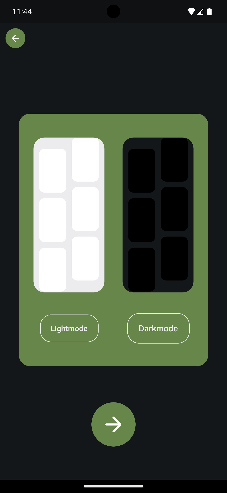

# Plants App Contest

<a href=""></img></a>

### Language & Tools used:

### Demo Preview Whitemode

| Onboard                                      | Onboard                                      | Onboard                                      | Name                                            |
| -------------------------------------------- | -------------------------------------------- | -------------------------------------------- | ----------------------------------------------- |
|  |  |  |  |

| Login                                            | Signup                                            | Theme                                            | Post                                            |
| ------------------------------------------------ | ------------------------------------------------- | ------------------------------------------------ | ----------------------------------------------- |
|  |  |  |  |

| Plant                                            | Home                                              |
| ------------------------------------------------ | ------------------------------------------------- |
|  |  |

### Demo Preview Darkmode

| Plant                                                 | Post                                                 | Signup                                                 | Theme                                                 |
| ----------------------------------------------------- | ---------------------------------------------------- | ------------------------------------------------------ | ----------------------------------------------------- |
|  |  |  |  |

| Profile                                                 | Post                                                 | Home                                                   | Test                                                 |
| ------------------------------------------------------- | ---------------------------------------------------- | ------------------------------------------------------ | ----------------------------------------------------- |
|  |  |  |  |

## Wiki Firebase

- Add authentication module
- Enable google signin
- Add firestore module
- Set rules to allow to read and write in DB
- Add storage module
- Set rules to allow to read and write in the cloud storage
- create ios/android application and fill data inside the main.dart such as API_KEY..
- hit flutter run, choose an emulator

## Credit

- Logo: pinterest.fr/pin/663155113869708837/

- First onboard animation: https://lottiefiles.com/animations/man-with-laptop-answering-email-next-to-plants-DZG4O2XpDq

- Second onboard animation: https://lottiefiles.com/animations/plant-moving-Fm8hkCPrOT

- Third onboard animation: https://lottiefiles.com/animations/plant-7d2aeAHoUX
